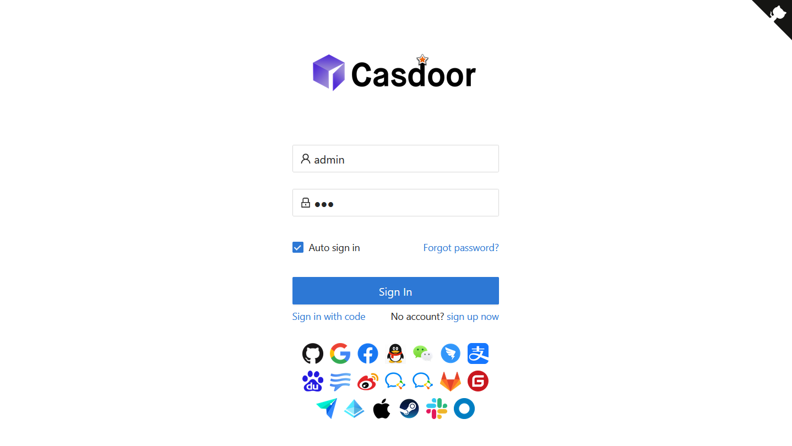

<h1 align="center" style="border-bottom: none;">Casdoor .NET SDK Samples</h1>

Here are Casdoor .NET SDK samples for **[casdoor-dotnet-sdk](https://github.com/casdoor/casdoor-dotnet-sdk)**.

| Sample Name                          | Dependencies      | **Description**                |
| ------------------------------------ | ----------------- | ------------------------------ |
| <a href="#ConsoleApp">ConsoleApp</a> | .NET 6.0 or newer | Sample of a simple console app |
| <a href="#MvcApp">MvcApp</a>         | .NET 6.0 or newer | Sample of a MVC webapp         |

## <a id="ConsoleApp">ConsoleApp</a>

This sample simply shows how to use [Casdoor.Client](https://github.com/casdoor/casdoor-dotnet-sdk/tree/master/src/Casdoor.Client) package. It is an API client implementation for the Casdoor, used to call the Casdoor APIs.

### Quickstart

```
git clone https://github.com/casdoor/casdoor-dotnet-sdk-example.git
cd casdoor-dotnet-sdk-example
dotnet run --project ConsoleApp
```

Some information will be displayed on the console, which is from the `Program.cs` file and has been processed by Casdoor.

### Configuration

Now open `Program.cs` file and you can see the following code:

```c#
var httpClient = new HttpClient();
var options = new CasdoorOptions
{
    Endpoint = "https://door.casdoor.com",
    OrganizationName = "build-in",
    ApplicationName = "app-build-in",
    ApplicationType = "native",
    ClientId = "541738959670d221d59d",
    ClientSecret = "66863369a64a5863827cf949bab70ed560ba24bf",
    CallbackPath = "/callback",
    RequireHttpsMetadata = true,
    Scope = "openid profile email"
};
var client = new CasdoorClient(httpClient, options);
```

The meanings of some fields are explained as follows:

| Name                 | Must | Description                                                  |
| -------------------- | ---- | ------------------------------------------------------------ |
| Endpoint             | Yes  | Your Casdoor host.                                           |
| OrganizationName     | Yes  | The organization that the application belongs to.            |
| ApplicationName      | Yes  | Your application name.                                       |
| ApplicationType      | Yes  | Your application type. Must be webapp, webapi or native.     |
| ClientId             | Yes  | Your OAuth client id.                                        |
| ClientSecret         | Yes  | Your OAuth client secret.                                    |
| CallbackPath         | No   | The callback path that the client will be redirected to after the user has authenticated. Default is "/casdoor/signin-callback". |
| RequireHttpsMetadata | No   | Whether requires https for Casdoor endpoint.                 |
| Scope                | No   | The scopes that the client is requesting.                    |

For more information, refer to https://github.com/casdoor/casdoor-dotnet-sdk/blob/master/README.md.

## <a id="MvcApp">MvcApp</a>

This sample shows how to use [Casdoor.AspNetCore](https://github.com/casdoor/casdoor-dotnet-sdk/tree/master/src/Casdoor.AspNetCore) package for Casdoor authentication. 

### Quickstart

```bash
git clone https://github.com/casdoor/casdoor-dotnet-sdk-example.git
cd casdoor-dotnet-sdk-example
dotnet run --project MvcApp
```

The default settings use the public demo Casdoor and Casnode configuration. Now Casdoor is listening on `http://localhost:3000`, and you can open your browser and visit it.



Input `admin` and `123` to sign in, or you can register a new account. 

### Configure your Casdoor

You can change the settings in the `appsettings.json` file according to the deployed Casdoor configuration. Here are relevant settings in this sample.

```json
"Casdoor": {
    "Endpoint": "https://door.casdoor.com",
    "OrganizationName": "casbin",
    "ApplicationName": "app-casnode",
    "ApplicationType": "webapp",
    "ClientId": "014ae4bd048734ca2dea",
    "ClientSecret": "f26a4115725867b7bb7b668c81e1f8f7fae1544d",
    "CallbackPath": "/callback",
    "RequireHttpsMetadata": false
},
```

The meanings of some fields are explained as follows:

| Name                 | Must | Description                                                  |
| -------------------- | ---- | ------------------------------------------------------------ |
| Endpoint             | Yes  | Your Casdoor host.                                           |
| OrganizationName     | Yes  | The organization that the application belongs to.            |
| ApplicationName      | Yes  | Your application name.                                       |
| ApplicationType      | Yes  | Your application type. Must be webapp or webapi. (webapi is not yet supported) |
| ClientId             | Yes  | Your OAuth client id.                                        |
| ClientSecret         | Yes  | Your OAuth client secret.                                    |
| CallbackPath         | No   | The callback path that the client will be redirected to after the user has authenticated. Default is "/casdoor/signin-callback". |
| RequireHttpsMetadata | No   | Whether requires https for Casdoor endpoint.                 |

In addition, some launch settings are placed in the `Properties/launchSettings.json` file, such as the listening URL `http://localhost:3000`, to facilitate your use of this sample. This file is not necessary.

For more information, refer to https://github.com/casdoor/casdoor-dotnet-sdk/blob/master/README.md.

